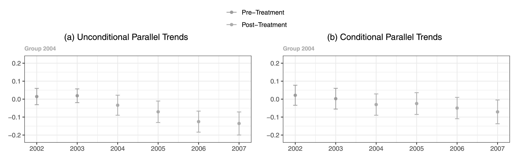

<br>

## Introduction about design-based studies

Another case where data visualizations can be of particular utility is in the context of describing average levels or change over time in a design-based study of some type.

<br>

### Motivation: how to effectively convey change, parallel trends and treatment heterogeneity

There are a few big reasons why it is useful to use visualizations within this type of research design and analysis. 

First, these methods depend on change over time for estimating average treatment effects on the treated. Describing change over time is one of the most common uses of data visualization, with a line plot being perhaps the most commonly employed option. So to start, this is a context where we don't have to be as worried about figures being unexpected or likely to perplex readers.

Second, if relevant, the parallel trends assumption is something that we'd like to assuage reviewers' and readers' concerns about and it turns out that we can fold empirical tests related to this assumption into our visualizations quite easily. We don't always have the capability to test for anticipatory effects pre-treatment, but when we do this is no doubt an important element to why visualizations are effective for difference-in-difference or event study designs.

Third, if relevant, we want to be able to illustrate treatment heterogeneity based on groups having different starting points to their treatment as well differences in length of exposure. Such heterogeneity can become difficult to assess in tabular forms, which may be less true of relatively simple DD designs, but with the use of visualizations, things like group-time specific average treatment effects can be more intuitive.

<br>

### How do we get there?

We will be focusing on making plots that visualize either trends over time for the treated and control groups of a design based study, or just the difference in trends between these two focal groups.

For relatively simple designs, it's straightforward to estimate the models and make predictions using the `fixest` library, which handles incorporating fixed effects and clustering errors quite conveniently. However, once we move towards more complex designs where we model treatment heterogeneity and dynamic treatment effects, in such cases there is a very useful package called `did` that provides a convenient means for estimating these models.

<br>

## Setup 

### Software dependencies

```{r}
library(tidyverse)   #dplyr, ggplot2
library(fixest)      #for simpler DD models
library(did)         #for event study models
library(broom)       #quickly process model output
```

<br>

## Data

### Fake two-period DD data

```{r}
#first let's simulate some simple two period DD data to model
set.seed(20220418)

#make the 2 period data
sim_2_period_param <- reset.sim(time.periods = 2)
sim_2_period <- build_sim_dataset(sim_2_period_param)

#look at the simulated data
glimpse(sim_2_period)
```

<br>

### Real-world event study data

The other data that we will look at are from a recent study about using difference-in-difference designs where there are multiple tiem periods of observation and treatment heterogeneity among the group receiving the intervention. These data are a strongly-balanced panel covering 500 U.S. counties observed across 5 time periods (2003-2007). The study these data are drawn from analyzes the effect of minimum wage policies on teen employment, and since the laws were passed at different times there is a need for an event study design that considers these differences in exposure timing and length.

> Callaway, B., & Sant’Anna, P. H. (2021). Difference-in-differences with multiple time periods. Journal of Econometrics, 225(2), 200-230.

```{r}
mpdta <- read_csv("./data/mpdata.csv")

glimpse(mpdta)
```

<br>

#### Dependent variable

The outcome is the log of teen employment from 2004 to 2007, taken from the Quarterly Workforce Indicators (QWI).

```{r}
summary(mpdta$lemp)
```

<br>

## What are the trends over time?

### Two period

Starting with the simulated 2 period data, this sort of plot is probably the most common for two period data. 

```{r}
#summarize the mean values before and after treatment
dd_2_period <- sim_2_period %>%
  group_by(period, treat) %>%
  summarize(mean_Y = mean(Y))

ggplot(dd_2_period, aes(x = period, y = mean_Y, shape = factor(treat), group = treat)) +
  geom_line() +
  geom_point(size = 2)
```

<br>

In some instances you see a counterfactual line added to denote what we expect the post treatment value to be under the assumptions of the DD model, and this can be added relatively easily.

```{r}
dd_2_period <- dd_2_period %>%
  group_by(treat) %>%
  mutate(chg = mean_Y[period == 2] - mean_Y[period == 1]) %>%
  ungroup() %>%
  mutate(cf = ifelse(period == 1, mean_Y, mean_Y[period == 1] + chg[treat == 0]))

ggplot(dd_2_period, aes(x = period, y = mean_Y, shape = factor(treat), 
                        group = treat, linetype = "Observed")) +
  geom_line() +
  geom_line(aes(x = period, y = cf, linetype = "Counterfactual")) +
  geom_point(aes(x = period, y = cf), size = 2.5) +
  geom_point(size = 3) +
  scale_x_continuous(breaks = c(1, 2), labels = c("Pre-treatment", "Post-treatment")) +
  scale_shape_discrete(labels = c("Control", "Treated")) +
  scale_linetype_manual(values = c(2, 1)) +
  labs(x = "", y = "Average Y\n", shape = "", linetype = "") +
  theme_bw() +
  theme(panel.grid.minor = element_blank(), 
        panel.grid.major.x = element_blank())
```

<br>

### Multiple periods

This sort of visualization extends to the use case of having multiple time periods, with the important assumption that the treatment timing is still uniform across groups. 

To demonstrate this, here we visualize the multiple-period `mpdta` using only the control cases and cases where treatment began in 2006. This is obviously just for demonstration and we wouldn't throw out the other cases in practice, but it's fairly clear what is going on in this plot.

Still, since the trends are relatively muted compared to difference in level over time, this is a case where we might start to prefer a plot looking just at the difference in trends between the two groups at each of the periods. This would help to scale the y-axis such that the changes are more perceptible, though as it stands right now the change in trends starting with treatment is still pretty easy to see.

```{r}
means <- mpdta %>%
  filter(first.treat %in% c(2006, 0)) %>%
  group_by(year, treat) %>%
  summarize(lemp = mean(lemp))

ggplot(means, aes(x = year, y = lemp, group = treat, shape = factor(treat))) +
  geom_vline(xintercept = 2006) +
  geom_line() +
  geom_point(size = 2.5) +
  scale_shape_discrete(labels = c("Control", "Treated")) +
  theme_bw() +
  theme(legend.position = "bottom", 
        panel.grid.minor = element_blank()) +
  labs(x = "", y = "Logged Teen Employment\n", shape = "")
```

<br>

In contrast, with treatment timing we have to retool things a bit. The result is not quite as simple since the small multiples are needed, but by overlaying the control group in each panel it is easier to make the implied comparison than if we had a separate panel for those cases.

```{r}
means <- mpdta %>%
  group_by(year, first.treat, treat) %>%
  summarize(lemp = mean(lemp)) %>%
  ungroup() %>%
  mutate(first.treat = ifelse(first.treat == 0, NA, first.treat)) %>%
  rowwise() %>%
  mutate(first.treat.chr = case_when(
           is.na(first.treat) ~ list(c(2004, 2006, 2007)), 
           TRUE ~ list(unique(first.treat)))) %>%
  ungroup() %>%
  unnest(first.treat.chr)

ggplot(means, aes(x = year, y = lemp, 
                  shape = factor(first.treat), linetype = is.na(first.treat),
                  group = factor(first.treat))) +
  facet_wrap(~ paste("First Treated:", first.treat.chr)) +
  geom_vline(aes(xintercept = first.treat)) +
  geom_line() +
  geom_point() +
  geom_point() +
  scale_linetype_discrete(labels = c("Treated", "Control")) +
  scale_shape_discrete(na.value = 4, labels = c("2004", "2006", "2007", "Control")) +
  theme_bw() +
  theme(legend.position = "bottom",
        panel.spacing = unit(.2, "in"),
        panel.grid.minor = element_blank()) +
  labs(x = "", y = "Logged Teen Employment\n", linetype = "Treatment Group") +
  guides(shape = "none")
```

<br>

## What are the average treatment effects? 

### Two time periods

Since a two period design produces a single estimate for the ATT, this is really a case where graphics don't offer much beyond conveying this information through a table if our focus is on a single model. 

```{r}
#estimate TWFE
model_2period <- feols(Y ~ period * treat | id, sim_2_period)

#give the summary info
summary(model_2period)
```


<br>

Now it is common to have multiple models due to including covariates, looking at particular subgroups or other reasons, and in these cases there could be value to presenting the focal information about the ATT provided by the different models' DD coefficients in a visualization (with the relevant model table in appendix). 

Here we arbitrarily model the odd and even ID'ed cases separately to illustrate what a multi-model graphic might look like using the DD coefficients and their SEs.

```{r}
model_2period_odds <- feols(Y ~ period * treat | id, sim_2_period %>% filter(id %% 2 == 1))
model_2period_evens <- feols(Y ~ period * treat | id, sim_2_period %>% filter(id %% 2 == 0))

coef_2period <- tidy(model_2period) %>%
  as_tibble() %>%
  mutate(model = "Overall")

coef_2period_odds <- tidy(model_2period_odds) %>%
  as_tibble() %>%
  mutate(model = "Odds")

coef_2period_evens <- tidy(model_2period_evens) %>%
  as_tibble() %>%
  mutate(model = "Evens")

model_coefs <- bind_rows(coef_2period, coef_2period_odds, coef_2period_evens) %>%
  filter(str_detect(term, "treat"))

ggplot(model_coefs, aes(x = estimate, y = model, 
                        xmin = estimate - 1.96 * std.error,
                        xmax = estimate + 1.96 * std.error)) +
  geom_errorbarh() +
  geom_point() +
  geom_vline(xintercept = 0) +
  theme_bw() +
  labs(x = "\nDD Coefficient", y = "Model Specification\n")
```

<br>

### Multiple time periods

Nonetheless, in instances where we have greater complexity to the study design, a figure illustrating the average treatment effects--whether group-time specific or averaged over these groups--can be useful.

Following the vignette from the `did` package website, we can use the following code to estimate the group-time average treatment effects without covariates.

```{r}
# estimate group-time average treatment effects without covariates
mw.attgt <- att_gt(yname = "lemp",
                   gname = "first.treat",
                   idname = "countyreal",
                   tname = "year",
                   xformla = ~ 1,
                   data = mpdta,
                   )

# summarize the results
summary(mw.attgt) 
```

<br>

There is a default plot method for the `did` package that enables you to avoid making the plot for yourself. 

```{r}
# plot the results
# set ylim so that all plots have the same scale along y-axis
ggdid(mw.attgt, ylim = c(-.3, .3), type = "calendar")
```

<br>

### A note about using color in figures

There are some accessibility issues with the default plot that may motivate modifications. Most important is that the default ggplot red and blue colors collapse to very similar shades of gray when printed in black and white. This is emblematic of a general problem that has to be grappled with when producing visualizations for published research articles. 

See the interpretability of the figure (cropped for size) from the Callaway and Sant'anna (2021) article in color:


Compared to in grayscale:



<br>

It's not impossible, but takes a lot more scrutiny to see the residual differences in shade once the blue and red hues are taken away.

While you do occasionally see folks punt and add a "you need to be looking at a PDF to see the color version and only this color version makes sense" caption to figures in an article, this is a case where we can easily make a change to have a color rich version for digital viewers, but a still comprehensible solution for print viewers.

*Enter:* `viridis`. You have probably already seen this palette in use and maybe you are even already a user yourself, but for any who are not familiar this is a wonderful tool for effective data visualization with color. All variations on the color palette change in their hue (i.e. RGB values) but also _value_ (grayscale). This means that, by default, the colors flatten to grays that should still perceptibly differ. Using discrete or binned values is a surefire way to ensure this is the case, since 4 or 5 levels of gray tend to be reasonably decipherable.

Thankfully, you can also pass `theming = FALSE` to `ggdid()` to have it produce an ATT plot but let you handle the theming yourself. There does not seem to be an easy way to manipulate the aesthetics of this plot (e.g., add a shape aesthetic for pre/post), unfortuantely, but you can make some useful modifications to your liking.

```{r, fig.height=6, fig.width=6}
# plot the results
# set ylim so that all plots have the same scale along y-axis
ggdid(mw.attgt, ylim = c(-.3, .3), type = "calendar", theming = FALSE) +
  scale_color_viridis_d(begin = .75, end = .25, labels = c("Pre-treatment", "Post-treatment")) +
  theme_bw() +
  theme(legend.position = "bottom") +
  labs(title = "", subtitle = "")
```

<br>

and, what would folks viewing our figure in print see?

{#id .class width=65% height=65%}

<br>

## How do the treatment effects vary by length of exposure?

```{r}
#aggregate the group-time average treatment effects
mw.dyn <- aggte(mw.attgt, type = "dynamic")

#print the summary output
summary(mw.dyn)

#use the default plot method
ggdid(mw.dyn, ylim = c(-.3, .3))
```

<br>

```{r}
# plot the results
# set ylim so that all plots have the same scale along y-axis
ggdid(mw.dyn, ylim = c(-.3, .3), type = "dynamic", theming = FALSE) +
  scale_color_viridis_d(begin = .75, end = .25, labels = c("Pre-treatment", "Post-treatment")) +
  theme_bw() +
  theme(legend.position = "bottom") +
  labs(title = "", subtitle = "")
```

<br>

## Hands-on: Use the `injury` data or your own data to make graphics for a DD model

The following hands-on practice uses data from the following article. 

> B.D. Meyer, W.K. Viscusi, and D.L. Durbin (1995), “Workers’ Compensation and Injury Duration: Evidence from a Natural Experiment,” American Economic Review 85, 322-340.

Since these are data from an R library, you can view the codebook [here](https://rdrr.io/cran/wooldridge/man/injury.html).

Model the data for Kentucky (`ki`) and Michigan (`mi`) separately. Make `log(durat)` the dependent variable, `afchnge` the policy change dummy variable (i.e., 1 = after policy change) and `highearn` the dummy variable for high earners (i.e., 1 = high earner).

```{r}
injury <- read_csv("./data/injury.csv")

glimpse(injury)
```

<br>